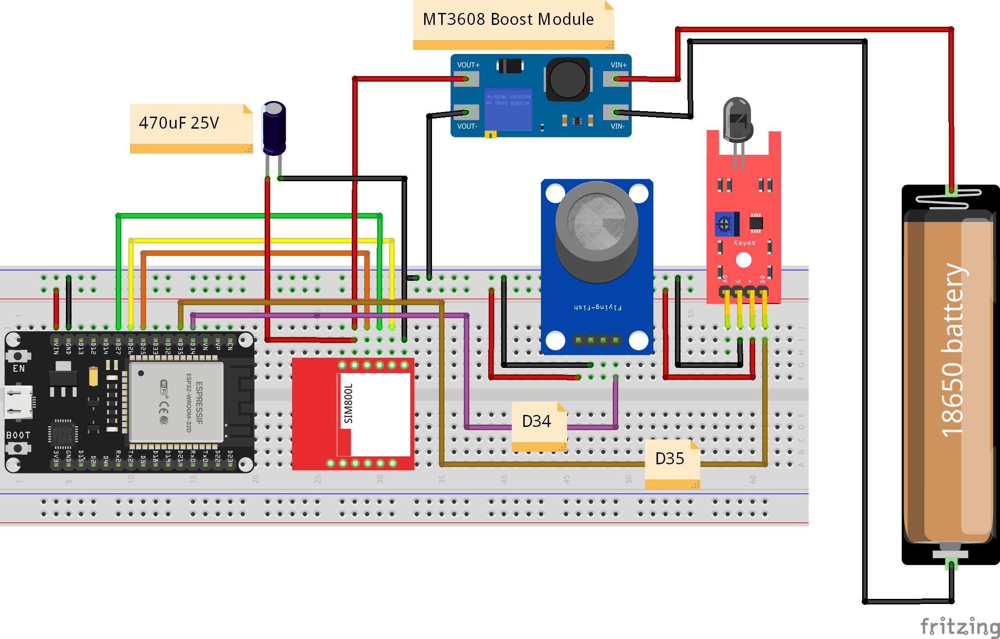

# IoT Fire & Gas Safety System with Two-Way GSM (ESP32 + SIM800L)

An autonomous environmental safety system using the **ESP32** and **SIM800L GSM Module**. This project monitors Smoke/Gas levels (MQ-2) and Fire detection (Flame Sensor) in real-time. It sends urgent **SMS alerts** to an admin number upon detection and supports **two-way communication** to query system status remotely.


*(Make sure to upload your circuit image to the repo with this filename)*

## 🚀 Features
* **Real-Time Monitoring:** Continuously scans for smoke (Analog) and fire (Digital).
* **Instant SMS Alerts:** Sends a warning text immediately when thresholds are breached.
* **Two-Way Communication:** Send the command `status` to the device to get a system report.
* **Smart Spam Protection:** Includes a 3-minute cooldown timer to prevent SMS flooding during a continuous fire event.
* **Network Sync:** Automatically synchronizes time with the GSM network.
* **Robust Power Design:** Uses a Boost Converter and Capacitor to handle SIM800L current spikes.

## 🛠️ Hardware Requirements
| Component | Description |
| :--- | :--- |
| **Microcontroller** | ESP32 Development Board (WROOM) |
| **GSM Module** | SIM800L (Red Module) |
| **Gas Sensor** | MQ-2 (Smoke/LPG/CO) |
| **Fire Sensor** | IR Flame Sensor Module |
| **Power Source** | 18650 Li-Ion Battery |
| **Voltage Regulator** | MT3608 DC-DC Step Up (Boost) Module (Set to ~4.0V - 4.2V) |
| **Stabilization** | 470uF 25V Capacitor (Required for SIM800L stability) |

## 🔌 Pinout & Wiring

| ESP32 Pin | Component Pin | Notes |
| :--- | :--- | :--- |
| **26** | SIM800L TX | |
| **27** | SIM800L RX | |
| **25** | SIM800L RST | |
| **34** | MQ-2 A0 | Analog Output |
| **35** | Flame D0 | Digital Output |
| **GND** | Common GND | **Crucial:** All GNDs must be connected |

**Power Note:** The SIM800L is powered via the MT3608 Boost Converter (fed by the 18650 battery) to ensure it gets enough current during transmission bursts. The 470uF capacitor is placed across the SIM800L power rails.

## 📦 Library Dependencies
You need to install the following libraries in the Arduino IDE:

1.  **TinyGSM** by Volodymyr Shymanskyy
2.  **StreamDebugger** (Optional, for AT command debugging)

## ⚙️ Configuration
Open the `.ino` file and update the following lines:

```cpp
// --- USER CONFIGURATION ---
#define ADMIN_NUMBER "+88017XXXXXXXX"  // Your Phone Number
#define SMS_COOLDOWN 180000            // Alert interval in ms (Default: 3 mins)
